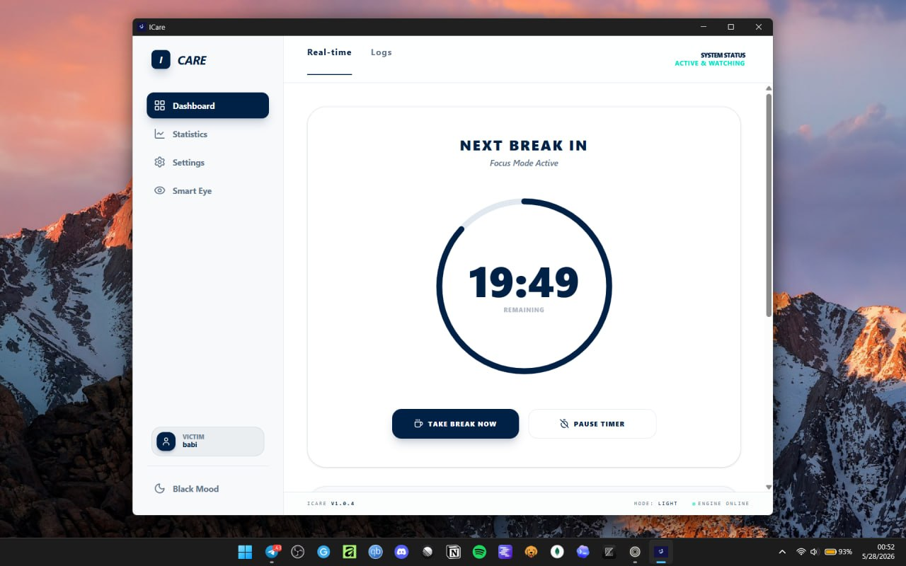
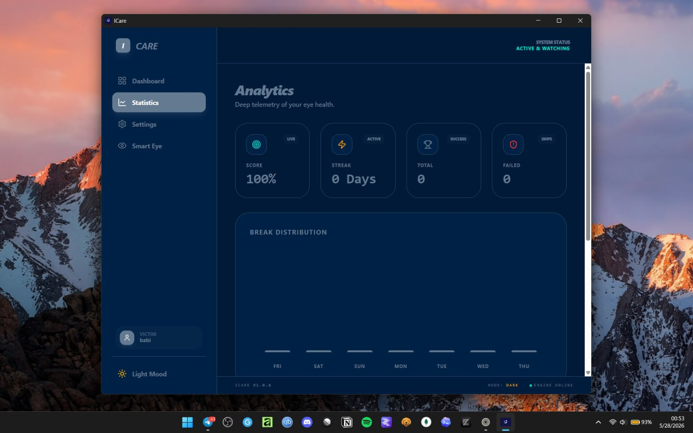
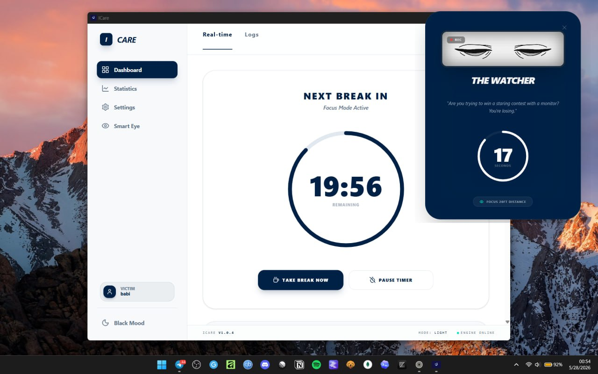
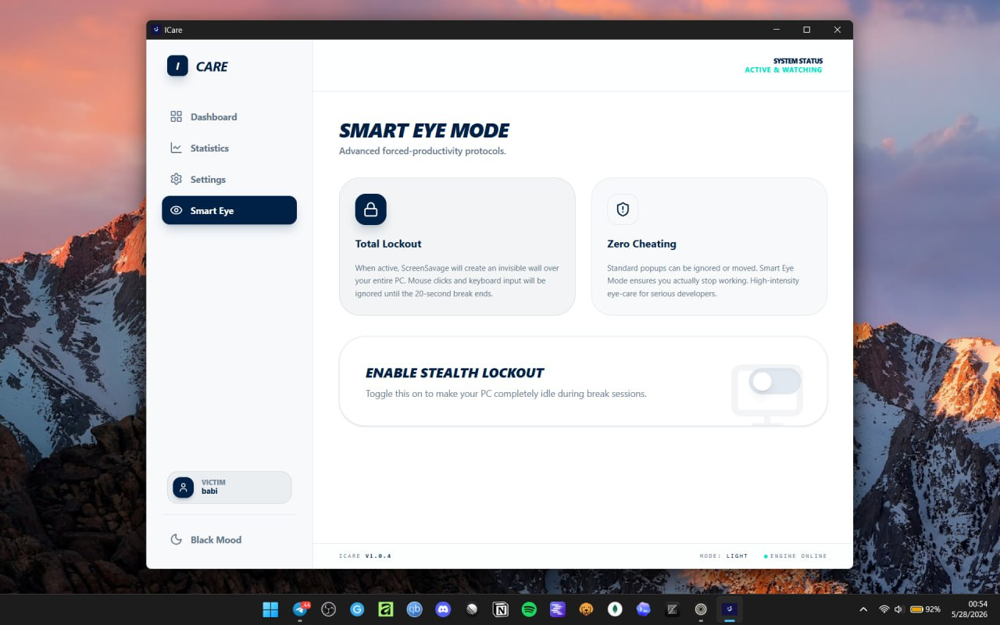

<div align="center">
  
  
  #  ICare
  ### *Because your eyes are failing, and you clearly lack discipline.*

  [](https://github.com/Lozaashenafi/Icare_showcase/releases)
  [](https://github.com/Lozaashenafi/Icare_showcase)
  [](https://www.electronjs.org/)
  [](https://reactjs.org/)
  [](LICENSE)
  [](http://makeapullrequest.com)

  <br>
  
  [**Download Now**](https://icare-site.vercel.app) • 
  [**Live Demo**](https://icare-site.vercel.app) • 
  [**Report Issue**](https://github.com/Lozaashenafi/Icare_showcase/issues) • 
  [**Request Feature**](https://github.com/Lozaashenafi/Icare_showcase/issues)
  
</div>


## The Problem
Let’s face it — you’ve spent the last 4 hours staring at a screen without blinking. Your eyes are dry, your neck hurts, and you know the *20-20-20 rule* exists… but you ignore it anyway.

Most eye-care apps are *too polite*. They send a gentle notification, you click "remind me later," and nothing changes. Your eyes lose. Every time.


## Why ICare?
**ICare is not polite.**  
It doesn’t ask. It doesn’t suggest. It **enforces** healthy screen habits using a mix of:

- **Timer discipline** (custom intervals from 5–60 minutes)  
- **Psychological accountability** – get roasted when you ignore breaks  
- **Stealth lockout mode** – an unavoidable, full-screen break overlay that bypasses every window on your system  

If you *still* refuse to rest your eyes, ICare will physically prevent you from working until your break is over. Your future self will thank you — even if your present self is annoyed.

> *“Discipline is choosing what you want most over what you want now.”* – ICare, probably.


##  Key Features

| Feature | Description |
|---------|-------------|
| **Surveillance Timer** | Set intervals from 5 to 60 minutes. The timer tracks your screen time like a hawk. |
| **Savage Personalities** | Choose your Watcher: *Professional*, *Sarcastic*, or *Full Savage Roast*. Each delivers a unique verbal wake-up call. |
| **Stealth Lockout** | An unavoidable, full-screen break overlay that sits on top of all applications. No alt-tabbing out. No closing. Just rest. |
| **Health Analytics** | Track your compliance rate: how many breaks you respected vs. how many times the app had to *force* you. |
| **Smart Eye Mode** | Full-screen kiosk mode that dims the display and guides you through a 20-second eye relaxation exercise. |
| **Clean UI** | Built with Tailwind CSS and Framer Motion for smooth, modern animations. |
| **Privacy First** | All settings and stats stored locally via `electron-store`. No cloud accounts required. |


## Screenshots

|  |  |
|  |  |

## 🚀 Installation

### 🪟 Windows
1. Download the latest installer: `ICare Setup 1.0.0.exe` from [the releases page](https://github.com/Lozaashenafi/Icare_showcase/releases) or the [website](https://icare-site.vercel.app).
2. Run the installer and follow the prompts.
3. Launch ICare from the Start Menu or Desktop shortcut.
4. Grant admin permissions if prompted (required for global overlay functionality).

### 🐧 Linux (Ubuntu/Debian)
ICare is distributed as an AppImage. For Ubuntu 22.04+ you may need `libfuse2`.

```bash
# 1. Download the AppImage (e.g., ICare-1.0.0.AppImage)
# 2. Make it executable
chmod +x ~/Downloads/ICare-1.0.0.AppImage

# 3. Install fuse dependency (if missing)
sudo apt update && sudo apt install libfuse2 -y

# 4. (Optional) Create a desktop entry for your app launcher
cat <<EOF > ~/.local/share/applications/icare.desktop
[Desktop Entry]
Name=ICare
Exec=$HOME/Downloads/ICare-1.0.0.AppImage --no-sandbox
Icon=utilities-eye
Type=Application
Categories=Utility;
EOF

# 5. Launch
~/Downloads/ICare-1.0.0.AppImage --no-sandbox
